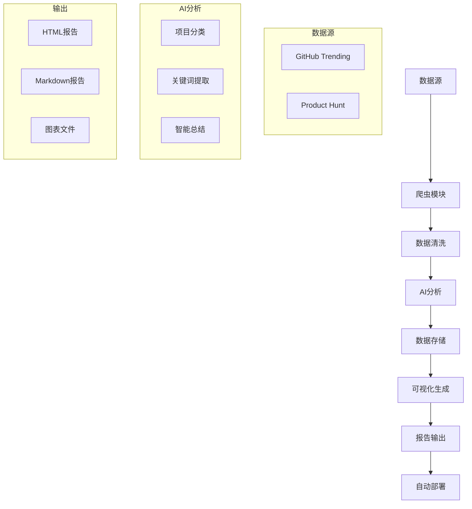

# AI爆款项目雷达 🚀

一个基于AI+爬虫技术的项目趋势监控系统，自动发现和分析GitHub Trending和Product Hunt上的热门AI项目。

## 🎯 功能特性

- 📦 **数据源抓取**: 自动爬取GitHub Trending、Product Hunt等平台的热门项目
- 🧠 **AI智能分析**: 使用GPT API判断项目是否为AI相关，提取关键词和趋势
- 📊 **数据可视化**: 生成精美的图表和报告，展示AI项目趋势
- 🔄 **自动更新**: 通过GitHub Actions实现每日自动更新和部署

## 🏗️ 系统架构

```
数据源 → 爬虫模块 → AI分析 → 数据处理 → 可视化 → 自动部署
```

## 📁 项目结构

```
ai-trending-radar/
├── src/                    # 源代码
│   ├── crawlers/          # 爬虫模块
│   ├── ai_analysis/       # AI分析模块
│   ├── utils/             # 工具函数
│   └── visualization/     # 可视化模块
├── data/                  # 数据存储
├── output/                # 输出文件
├── config/                # 配置文件
├── tests/                 # 测试文件
└── .github/workflows/     # GitHub Actions
```

## 🚀 快速开始

### 环境要求

- Python 3.8+
- OpenAI API Key

### 安装依赖

```bash
cp config/settings.yaml.example config/settings.yaml

```

### 配置

1. 复制配置文件模板：
```bash
cp config/settings.yaml.example config/settings.yaml
```

2. 编辑配置文件，添加你的API密钥

### 运行

```bash
python main.py
```

## 📈 数据源

- **GitHub Trending**: 每日热门开源项目
- **Product Hunt**: 新产品发布平台
- 更多数据源持续添加中...

## 🤖 AI分析能力

- 项目AI相关性判断
- 技术栈分析
- 趋势关键词提取
- 项目总结生成

## 📊 可视化输出

- 每日AI项目趋势报告
- 关键词云图
- 项目分类统计
- 历史趋势分析

## 🔧 技术栈

- **爬虫**: Python + requests + BeautifulSoup
- **AI分析**: OpenAI GPT API
- **可视化**: Matplotlib + Plotly + Mermaid.js
- **自动化**: GitHub Actions
- **部署**: GitHub Pages

## 📝 许可证

MIT License

## 🤝 贡献

欢迎提交Issue和Pull Request！

## 🚀 快速开始

### 方法一：自动安装（推荐）

```bash
# 1. 克隆项目
git clone https://github.com/your-username/ai-trending-radar.git
cd ai-trending-radar

# 2. 运行自动安装脚本
python setup.py
```

### 方法二：手动安装

```bash
# 1. 克隆项目
git clone https://github.com/your-username/ai-trending-radar.git
cd ai-trending-radar

# 2. 创建虚拟环境（推荐）
python -m venv venv
source venv/bin/activate  # Windows: venv\Scripts\activate

# 3. 安装依赖
pip install -r requirements.txt

# 4. 配置文件
cp config/settings.yaml.example config/settings.yaml
cp .env.example .env

# 5. 设置API密钥（编辑 .env 文件）
# OPENAI_API_KEY=your-openai-api-key-here
```

### 验证安装

```bash
# 运行验证脚本
python verify_setup.py

# 运行演示（使用示例数据）
python demo.py

# 执行完整流程
python main.py --mode daily
```

### 查看结果

- 📊 **HTML报告**: `output/reports/ai-trends-YYYY-MM-DD.html`
- 📝 **Markdown报告**: `output/reports/ai-trends-YYYY-MM-DD.md`
- 📈 **图表文件**: `output/charts/`
- 🌐 **网页版本**: `output/web/index.html`

## 📖 详细文档

- 📋 [安装指南](docs/INSTALLATION.md) - 详细的安装和配置说明
- 📚 [使用指南](docs/USAGE.md) - 完整的使用教程和高级功能
- 🚀 [部署指南](docs/DEPLOYMENT.md) - GitHub Actions和云服务器部署
- 🔧 [API文档](docs/API.md) - 开发者API参考

## 🎯 主要特性

### 📦 智能数据收集
- **多源爬取**: 自动爬取GitHub Trending、Product Hunt等平台
- **智能去重**: 基于相似度算法的项目去重
- **数据标准化**: 统一的数据格式和质量保证

### 🧠 AI驱动分析
- **项目分类**: 使用GPT模型判断项目是否为AI相关
- **关键词提取**: 自动提取技术关键词和趋势词汇
- **智能总结**: 生成项目的中文总结和亮点分析
- **趋势分析**: 基于数据的技术趋势洞察

### 📊 丰富的可视化
- **交互式图表**: 使用Plotly生成的动态图表
- **多维度分析**: 编程语言、星标数、关键词等多角度展示
- **精美报告**: 自动生成HTML和Markdown格式报告
- **移动友好**: 响应式设计，支持各种设备

### 🔄 全自动化运行
- **定时执行**: GitHub Actions每日自动更新
- **零维护**: 自动数据清理和错误恢复
- **实时部署**: 自动部署到GitHub Pages
- **监控告警**: 完善的日志和错误处理

## 🛠️ 技术架构



## 📈 示例输出

### 每日AI项目报告


### 技术趋势分析
- 🔥 **热门技术**: Large Language Models, Computer Vision, MLOps
- 🚀 **新兴趋势**: Multimodal AI, Edge AI, AI Safety
- 💻 **主流语言**: Python (45%), JavaScript (23%), TypeScript (15%)
- 📊 **应用领域**: 自然语言处理、计算机视觉、推荐系统

## 🤝 贡献指南

我们欢迎各种形式的贡献！

### 如何贡献

1. **Fork** 这个仓库
2. 创建你的特性分支 (`git checkout -b feature/AmazingFeature`)
3. 提交你的更改 (`git commit -m 'Add some AmazingFeature'`)
4. 推送到分支 (`git push origin feature/AmazingFeature`)
5. 打开一个 **Pull Request**

### 贡献类型

- 🐛 **Bug修复**: 发现并修复问题
- ✨ **新功能**: 添加新的数据源、分析方法或可视化
- 📚 **文档改进**: 完善文档和示例
- 🎨 **界面优化**: 改进报告样式和用户体验
- 🔧 **性能优化**: 提升系统性能和稳定性

## 📄 许可证

本项目采用 MIT 许可证 - 查看 [LICENSE](LICENSE) 文件了解详情。

## 🙏 致谢

- [OpenAI](https://openai.com/) - 提供强大的AI分析能力
- [GitHub](https://github.com/) - 优秀的代码托管和自动化平台
- [Product Hunt](https://www.producthunt.com/) - 创新产品发现平台
- [Plotly](https://plotly.com/) - 强大的数据可视化库

## 📞 联系我们

- 📧 **邮箱**: your-email@example.com
- 🐛 **问题反馈**: [GitHub Issues](https://github.com/your-username/ai-trending-radar/issues)
- 💬 **讨论**: [GitHub Discussions](https://github.com/your-username/ai-trending-radar/discussions)

---

⭐ 如果这个项目对你有帮助，请给个Star支持一下！

🚀 **立即开始探索AI项目的无限可能！**
